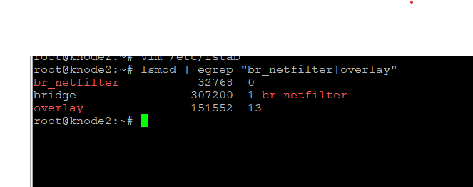
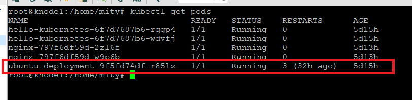
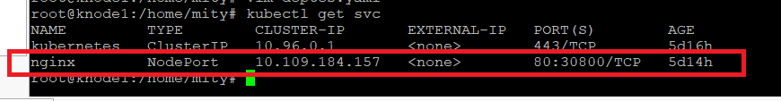
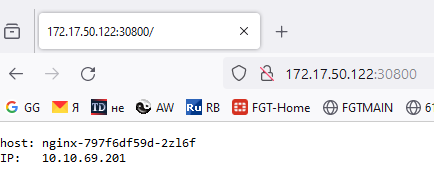

# Установка Kubernetes, тестирование различных сценариев, заметки

---

## Установка kubernetus 1.29.4 на ubuntu 22.0 

knode1 - 172.17.50.122 - мастер нода

knode2 - 172.17.50.128 - воркер 1

knode3 - 172.17.50.12- воркер 2


<details>
  <summary>Подготовительная часть</summary>

Добавляем запись в hosts т.к. не используем dns

 ```
printf "\n172.17.50.122 knode1\n172.17.50.128 knode2\n172.17.50.129 knode3\n\n" >> /etc/hosts
 ```

Отключаем  swap - vim /etc/fstab/ и комментируем строку

 ```
#/swap.img      none    swap    sw      0       0
 ```

обновляем репозитории, ставим обновления, ставим необходимые пакеты

 ```
apt update && apt -y upgrade && apt -y install apt-transport-https ca-certificates curl gnupg2 software-properties-common
```

Загружаем сетевые модули из ядра и создаем конфигурационный файл k8s.conf с указанными модулями.
```
cat <<EOF | tee /etc/modules-load.d/k8s.conf
overlay
br_netfilter
EOF
```
```
modprobe overlay
modprobe br_netfilter
```

проверяем что модули активированы

```
lsmod | egrep "br_netfilter|overlay"
```

     Картинка !


включаем сетевые параметры отвечающие за маршрутизация трафика через сетевой мост, нужно для работы сетевых (CNI) плагинов кубера работающих через iptables.

```
cat <<EOF | tee /etc/sysctl.d/k8s.conf
net.bridge.bridge-nf-call-iptables  = 1
net.bridge.bridge-nf-call-ip6tables = 1
net.ipv4.ip_forward                 = 1
EOF
```

Перезапускаем параметры ядра

```
sysctl --system
```
Выключаем firewalld:

```
systemctl stop ufw && systemctl disable ufw
```

</details>


<details>
  <summary>Часть установки</summary>

устанавливаем  containerd  и запускаем службу:

```
wget https://github.com/containerd/containerd/releases/download/v1.7.16/containerd-1.7.16-linux-amd64.tar.gz
tar Cxzvf /usr/local containerd-1.7.16-linux-amd64.tar.gz

wget https://raw.githubusercontent.com/containerd/containerd/main/containerd.service
mv containerd.service /usr/local/lib/systemd/system/ 
systemctl daemon-reloadsystemctl daemon-reload
systemctl enable --now containerd 
systemctl status containerd.service
```


**Containerd** — это бывшая часть Docker, а ныне самостоятельное решение, реализующее исполняемую среду для запуска контейнеров.

Он предоставляет минимальный набор функций для управления образами, а также для запуска и остановки контейнеров.

Устанавливаем версию runc необходимую для работы containerd:

```
wget https://github.com/opencontainers/runc/releases/download/v1.1.12/runc.amd64
install -m 755 runc.amd64 /usr/local/sbin/runc
```
Устанавливаем сетевые плагины (CNI):

```
mkdir -p /opt/cni/bin 
wget https://github.com/containernetworking/plugins/releases/download/v1.4.1/cni-plugins-linux-amd64-v1.4.1.tgz 
tar Cxzvf /opt/cni/bin cni-plugins-linux-amd64-v1.4.1.tgz  
mkdir -p /etc/containerd
```

Генерируем дефолтный файл конфига containerd и вносим правки:

```
containerd config default | tee /etc/containerd/config.toml
vim  /etc/containerd/config.toml
```

находим значение и выставляем SystemdCgroup = true


перезапускаем и проверяем

```
systemctl restart containerd 
systemctl status containerd
```

Устанавливаем Kubernetes с использованием hold. т.е. при выходе новых версий компонентов они обновляться не будут.

```
mkdir -p -m 755 /etc/apt/keyrings 
curl -fsSL https://pkgs.k8s.io/core:/stable:/v1.29/deb/Release.key | gpg --dearmor -o /etc/apt/keyrings/kubernetes-apt-keyring.gpg
echo 'deb [signed-by=/etc/apt/keyrings/kubernetes-apt-keyring.gpg] https://pkgs.k8s.io/core:/stable:/v1.29/deb/ /' | tee /etc/apt/sources.list.d/kubernetes.list
apt update && apt -y install kubelet kubeadm kubectl && apt-mark hold kubelet kubeadm kubectlapt update && apt -y install kubelet kubeadm kubectl && apt-mark hold kubelet kubeadm kubectl
```

**Все предыдущие шаги нужно выполнить для каждой ноды !**


Инициализируем мастер ноду и выделяем подсеть для нод в кластере:

```
kubeadm init --pod-network-cidr=10.10.0.0/16 --kubernetes-version 1.29.4 --node-name knode1
```

после инициализации ноды выполняем шаги:

```
mkdir -p $HOME/.kube
sudo cp -i /etc/kubernetes/admin.conf $HOME/.kube/config
sudo chown $(id -u):$(id -g) $HOME/.kube/config

если под рутом, то:

export KUBECONFIG=/etc/kubernetes/admin.conf
```

На мастер ноде копируем появившуюся команду для подключения новых нод и выполняем её на нодах или запрашиваем текст данной команды:

```
kubeadm token create --print-join-command
```

Проверяем появились ли новые ноды:

```
kubectl get nodes -o wide
```

если вылетаем ошибка, то в моём случае помогло копирование $HOME/.kube/config
на все оставшиеся ноды.


Повторяем команду и видим, что у подключенных нод в разделе ROLES стоим none, это лейбл, который правится:

```
kubectl label nodes knode2 node-role.kubernetes.io/worker=worker
kubectl label nodes knode3 node-role.kubernetes.io/worker=worker
```

</details>


<details>
  <summary>Часть проверки</summary>

Создаём простейший deployment:

```
vim ubuntu.yaml
```

```
apiVersion: apps/v1
kind: Deployment
metadata:
  name: ubuntu-deployment
  labels:
    app: ubuntu
spec:
  replicas: 1
  selector:
    matchLabels:
      app: ubuntu
  template:
    metadata:
      labels:
        app: ubuntu
    spec:
      containers:
      - name: ubuntu
        image: ubuntu
        command: ["sleep", "123456"]
      nodeSelector:
        beta.kubernetes.io/os: linux
```

запускаем deployment

```
kubectl apply -f ubuntu.yaml
```

проверяем, что под запустился

```
kubectl get pods  
```




подключаемся внутрь контейнера:

```
kubectl exec -it ubuntu-deployment-9f5fd74df-r85lz -- /bin/bash
```

выполняем команды:

```
apt update
apt-get install -y iputils-ping
ping ya.ru
```
если все команды прошли, значит всё ок.


Проверка доступности deployment снаружи через Nodeport.

Данный deployment должен отдавать при запросе с наружи свой hostname и ip адрес


создаём deployment:

```
vim deptest.yaml
```

```
apiVersion: apps/v1
kind: Deployment
metadata:
  name: nginx
  labels:
    app: nginx
spec:
  replicas: 1
  selector:
    matchLabels:
      app: nginx
  template:
    metadata:
      labels:
        app: nginx
    spec:
      containers:
      - name: nginx
        image: nginx:1.23
        volumeMounts:
          - name: conf
            mountPath: /etc/nginx/nginx.conf
            subPath: nginx.conf
            readOnly: true
      volumes:
        - name: conf
          configMap:
            name: nginx-conf
            items:
              - key: nginx.conf
                path: nginx.conf
---
apiVersion: v1
kind: ConfigMap
metadata:
  name: nginx-conf
data:
  nginx.conf: |
    events {
        worker_connections  1024;
    }
    http {
        server {
            location / {
                default_type text/plain;
                return 200 "host: $hostname\nIP:   $server_addr\n";
            }
        }
    }
---
apiVersion: v1
kind: Service
metadata:
  name: nginx
spec:
  selector:
    app: nginx
  type: NodePort
  ports:
    - port: 80
      nodePort: 30800

```

запускаем deployment    

```
kubectl apply -f deptest.yaml
kubectl get svc
```




обращаемся к данному порту по внешнему адресу мастер ноды




</details>


Добавляем autocompletion

```
# install bash-completion on debian
apt update && apt install -y bash-completion

# add the following lines to your .bashrc file
echo 'source <(kubectl completion bash)' >> ~/.bashrc
echo 'source /usr/share/bash-completion/bash_completion' >> ~/.bashrc
echo 'alias k=kubectl' >> ~/.bashrc
echo 'complete -o default -F __start_kubectl k' >> ~/.bashrc

# source your .bashrc
source ~/.bashrc
```


